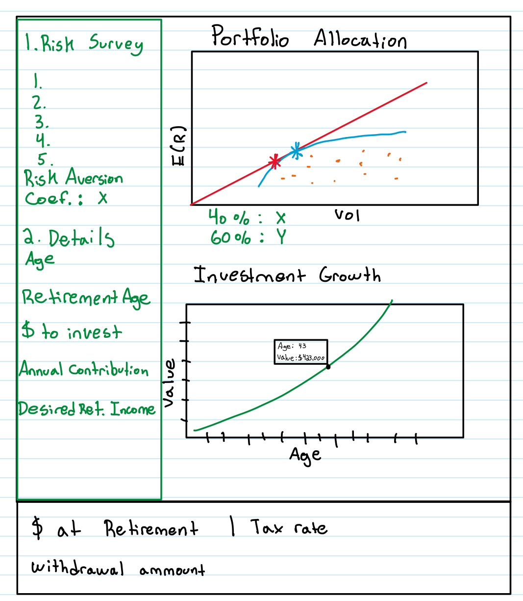

# Research Question
## Bigger Question
The broader issue at hand is the increasing responsibility on individuals to manage their retirement savings effectively, amidst a backdrop of volatile markets, unlimited investment options, and complex tax implications. With wealth managers and financial advisors taking 1% of client wealth every year, there is a growing need for tools that can simplify wealth management and retirement preparation, empowering individuals to make informed investment decisions.
## Specific Research Questions
- How can we provide individual investors with a personalized, optimal investment portfolio that aligns with their retirement goals, risk tolerance, and market outlook, without the need for a financial advisor?
- What are the impacts of including non-traditional investment options (such as ESG, cryptocurrency, and real estate) in retirement portfolios, across different levels of risk aversion?
- What portfolio allocation maximizes the utility function for an investor based on a certain number of ETF's and risk-free assets?
## Type of Project
Our project does not necessarily fit into the usual prediction or analysis models. Instead, it uses a dashboard to run simulations based on what users input, showing them how different investment choices could play out over time in a straightforward and interactive way. Some examples of this would displaying a client's efficient frontier based on the assumptions they put in or showing graphs that display the weights of their portfolio over time between different indexes. Lastly, we want to make sure this dashboard is easy to navigate through and easy for a user to learn how to use it by just looking at it for a few seconds. 

# Necessary Data
## Final Dataset Requirements
- Observation Unit: A security. For example, FBTC, VOO, VIGAX, etc. 
- Sample Period: The average expected return, sigma, beta over a timeframe that is long enough to generate an accurate assumption. (5/10 years) This depends on the security.  
- Sample Conditions: Historical data from each security will be in a different dataset and we will calculate the necessary statistics needed for our final dataset and model.
- Necessary Variables: Historical returns, volatility (standard deviation), beta, tax rates, and dividend yields, potentially fees associated with ETFs.
- Example:

| Ticker | Beta | Expected Return | Div. Yield | Variance |
|--------|------|-----------------|------------| ---------|
| QQQ    | 1.04 | 0.1245          | 0.04       | .08      |

- We would also need to store tax rates somewhere and risk free rates (if we decide to not use a bond index)

## Data Availability
All historical data this is needed is publicly accessible. We also have current dividend yields and tax rates. Since our dashboard will be for the future, we may have to modify these rates as they will change in the future and the future rates are not available. 
## Data Collection
Additional data will be collected through public financial databases. For example, CRSP, Yahoo Finance, etc.. We will then calculate all of the necessary calculations and import them to the final dataframe. 
## Raw Inputs and Storage
### Portfolio Allocation 
There will be a short quiz that the user will take, allowing us to assign a risk-aversion coefficient to them. 
### Investment Growth
Raw inputs will be inputs that the user enters into the dashboard. These inputs will be Age, Retirement age, annual contribution, money to invest, desired retirement income, investment preferences (Crypto, Real Estate, ESG). These will be stored in a dataframe and entered into the model. Similar to the midterm project, we will have an inputs folder that the model reads and the output will be displayed on the dashboard.
## Data Transformation Speculation
Raw market data will be cleaned, normalized, and merged to create a comprehensive dataset. We will also then have to calculate annualized returns and volatility and Beta for each security. This may be difficult as some indexes have not been around for a long time, which brings up the question of how we get an annualized return. For example, Bitcoin ETFs are very new, so it will be difficult to generate an accurate annualized return. To account for this, we will need to research historical data and potentially have to create our own assumptions. Additionally, we may also need to use different pricing models to calculate an expected return.

# What the Dashboard Will Look Like
## Summary 
Below are the various inputs and outputs of our wealth advisor dashboard. Enjoy :)
## Inputs
### Portfolio Allocation
- Risk Tolerance 
    - We will give the user a risk-aversion quiz that will allow us to calculate their risk-aversion coefficient. This coefficient will be used to determine their optimal portfolio allocation.
- Potentially: Market Outlook(Some sort of scale related to what the clients outlook on the market is)
    - We may use this as another factor when determining the user's risk-aversion coefficient.
### Investment Growth
- Age
- Retirement age
- Desired retirement income(Taxed or Pretaxed)
- Money to Invest
- Annual contribution to investment
- Preference for specific types of investments (e.g., Cryptocurrency, Real Estate, ESG)
## Outputs
- Portfolio Allocation: Graphs showing the allocation of investments across different asset classes (stocks, bonds, real estate, etc.) 
- and/or (unsure which would be more insightful at this time)
- Efficient Frontier Visualization: A plot displaying the efficient frontier based on the user’s risk tolerance and investment preferences, helping them understand the risk/reward trade-off
- Projected Retirement Savings: A graph or series of graphs showing projected growth of the portfolio over time, including contributions and expected returns
    - This graph will be interactive so the user can look at each year and each corresponding portfolio value. 
    - There will be a list of outputs showing total portfolio value, tax implications, yearly withdrawal amount.
# What it will look like

## How We Will Do This
The top graph with be created by creating a model or using ML to find the optimal portfolio that maximizes the utility function of the user. This will be done by testing portfolio allocations of all kinds. For example, we would test 95% QQQ and 5% Risk Free, then 94% QQQ and 6% risk free, and so on. This would be done for each combination of risky and risk free asset. There will likely be around 10 risky assets and between 1 and 3 risk free assets. The portfolio expected return and variance will then be calculated using weighted averages. Then, we will be able to calculate the user's utility since we will have their risk aversion coef., expected return and variance. 

The bottom graph will be created by taking this optimal portfolio's expected return and graph it over the course of (retirement age-age) years. 
# Working Dashboard
Although we did not implement our specific application for the dashboard yet, we have a working dashboard hosted by streamlit. Here is this link: https://wealth-advisor-dashboard-zxeuck5wssugu23mf7cjon.streamlit.app/ 
# Caveat
While our team is fully committed to this project, we understand the importance of flexibility. If data availability or project complexity becomes a significant obstacle, we're open to considering alternative research directions. Our goal is to deliver valuable insights/research, and we're prepared to adjust course as needed to ensure a successful outcome of this goal.

